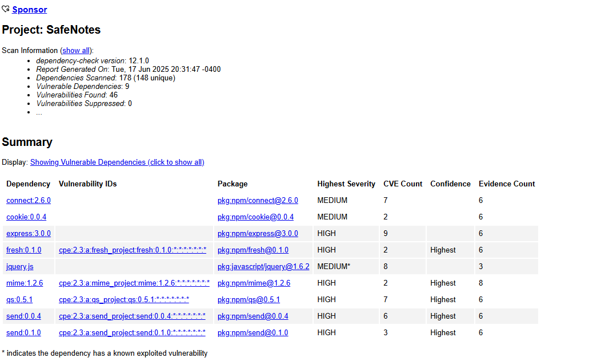

# 🛡️ SafeNotes

**SafeNotes** es una aplicación básica en Node.js con Express (v3.x), diseñada como laboratorio para integrar seguridad en un flujo CI/CD con **Jenkins**, **OWASP Dependency-Check** y **OWASP ZAP**.

---

## 📌 Objetivos del proyecto

- Integrar herramientas de seguridad en un entorno CI/CD.
- Usar Jenkins para automatizar pruebas, auditoría de dependencias y reportes.
- Generar reportes de vulnerabilidades estáticas (Dependency-Check) y dinámicas (ZAP).
- Documentar el proceso para propósitos educativos o demostrativos.

---

## ⚙️ Tecnologías utilizadas

- Node.js `v10.24.1`
- Express `v3.0.0`
- Jenkins (pipeline declarativo)
- OWASP Dependency-Check
- OWASP ZAP
- HTML Publisher Plugin (Jenkins)
- Git & GitHub

---

## 🧰 Requisitos previos

- ✅ Node.js instalado
- ✅ Git configurado
- ✅ Jenkins en Windows con plugins:
- ✅ Pipeline
- ✅ HTML Publisher
- ✅ OWASP Dependency-Check CLI instalado
- ✅ OWASP ZAP (GUI o CLI) instalado

---

## 📁 Estructura del proyecto
safenotes/
├── index.js
├── package.json
├── Jenkinsfile
├── reports/
│ └── dependency-check-report.html
├── zap-report.html
└── README.md

---

🔍 Análisis con OWASP Dependency-Check
Esta herramienta escanea tus dependencias en package.json y node_modules para detectar CVEs conocidos.

✅ Resultado
Se escanearon 178 dependencias.
Dependencias vulvenrables 9.
Vulnerabilidades 46.
Reporte:
start reports/dependency-check-report.html

Dependencias con vulnerabilidades detectadas
Durante el análisis de seguridad realizado con Dependency-Check, se identificaron vulnerabilidades en las siguientes dependencias de nuestro proyecto:

connect versión 2.6.0 (7 vulnerabilidades, severidad media)

cookie versión 0.0.4 (2 vulnerabilidades, severidad media)

express versión 3.0.0 (9 vulnerabilidades, severidad alta)

fresh versión 0.1.0 (2 vulnerabilidades, severidad alta)

jquery.js versión 1.6.2 (8 vulnerabilidades, severidad media)

mime versión 1.2.6 (2 vulnerabilidades, severidad alta)

qs versión 0.5.1 (7 vulnerabilidades, severidad alta)

send versiones 0.0.4 y 0.1.0 (6 y 3 vulnerabilidades, severidad alta)

Versiones recomendadas para actualizar
Se recomienda actualizar todas las dependencias vulnerables a sus versiones más recientes y mantenidas para garantizar la seguridad y estabilidad del proyecto. En particular:
express debe actualizarse a la última versión estable (actualmente 4.x o superior), ya que la versión 3.0.0 es obsoleta y contiene múltiples vulnerabilidades críticas.

jquery debe actualizarse a la versión 3.x o superior para corregir vulnerabilidades conocidas.

Para las demás dependencias (connect, cookie, fresh, mime, qs y send), es recomendable revisar y actualizar a las versiones más recientes disponibles en sus respectivos repositorios oficiales o en npm, asegurándose de que no contengan vulnerabilidades reportadas.

---

🕵️ Escaneo de seguridad con OWASP ZAP
🔄 Pasos realizados
Levantar servidor local:
node index.js
Abrir OWASP ZAP.
Usar modo Spider para rastrear http://localhost:8080.
Ejecutar análisis activo.

📊 hallazgos
Encabezados de seguridad faltantes.
Cookies sin atributos HttpOnly o Secure.
Posibles vectores de inyección.

---

🔍 Preguntas Finales

📌 ¿En qué etapa del desarrollo debe integrarse cada herramienta?
SCA (Software Composition Analysis), como OWASP Dependency-Check, debe integrarse desde el inicio del desarrollo y mantenerse en cada build. Detecta vulnerabilidades en dependencias de terceros antes de que lleguen a producción.

SAST (Static Application Security Testing) se puede aplicar justo después de escribir código o en etapas tempranas del pipeline. Analiza el código fuente sin necesidad de ejecutarlo.

DAST (Dynamic Application Security Testing), como OWASP ZAP, es ideal para usar en ambientes de prueba o staging, ya que escanea la aplicación mientras está en ejecución. Es útil para detectar vulnerabilidades como inyecciones o errores de configuración.

---

💡 ¿Cuál ofrece más valor para prevenir fallos en producción?

Cada herramienta aporta valor desde distintos ángulos, pero:

DAST (ZAP) es la que se acerca más al entorno real de producción. Detecta fallos que pueden pasar desapercibidos en el código, como configuraciones inseguras o errores de autenticación.

Sin embargo, una combinación de SCA + SAST + DAST en el pipeline es la mejor estrategia para minimizar riesgos.

---

🧠 ¿Qué aprendí sobre la diferencia entre SAST, DAST y SCA?

Durante el desarrollo de SafeNotes, comprendí las diferencias clave entre tres enfoques de seguridad esenciales:

SAST analiza el código fuente antes de ejecutarse. Es útil para detectar errores de seguridad directamente en la lógica del programa, como inyecciones o manejo inseguro de datos. Idealmente se implementa mientras se escribe el código. En este proyecto no lo implementamos, pero podría integrarse con herramientas como SonarQube.

DAST analiza la aplicación en ejecución, simulando ataques externos como un usuario malicioso lo haría. Este enfoque es útil para encontrar vulnerabilidades en la interacción real con la app, como problemas de autenticación, sesiones o errores en el servidor. En este proyecto se utilizó OWASP ZAP para realizar pruebas dinámicas.

SCA revisa las dependencias de terceros (como librerías NPM) para detectar vulnerabilidades conocidas. Es una forma eficiente de encontrar problemas sin revisar línea por línea. En SafeNotes, implementamos esta práctica con OWASP Dependency-Check.

Entendí que estas tres técnicas no se excluyen entre sí, sino que deben combinarse para lograr una cobertura de seguridad completa en todas las etapas del desarrollo.

---

🔧 ¿Qué herramientas fueron más fáciles de implementar?

OWASP Dependency-Check fue muy sencilla de integrar. Solo requería ejecutarla con un comando desde el pipeline.

Jenkins también fue amigable gracias a su interfaz gráfica, aunque requirió algo más de configuración inicial.

ZAP fue más compleja por ser una herramienta más avanzada, pero su versión de línea de comandos (zap-cli o zap-baseline.py) permite integrarla al pipeline de forma efectiva.

🔐 ¿Cómo DevSecOps mejora la seguridad sin frenar el desarrollo?

DevSecOps integra la seguridad desde el inicio (Shift Left), automatizando revisiones en el mismo flujo de desarrollo. Esto significa:

No se requiere parar el desarrollo para auditar manualmente.

Las alertas de seguridad aparecen directamente en el pipeline.

Los problemas pueden solucionarse en caliente, justo cuando se introducen, no después de que llegan a producción.

En este proyecto, todo el análisis se disparaba automáticamente al hacer un push a GitHub, permitiendo mantener el flujo de trabajo ágil.

---

🤖 ¿Qué parte del proceso automatizarías completamente en una empresa?

Automatizaría estas partes sin dudarlo:

✅ Instalación y prueba de dependencias (npm install, npm test)

✅ Análisis de dependencias con Dependency-Check

✅ Escaneo de seguridad con ZAP en entornos de staging

✅ Despliegue a producción solo si el pipeline de seguridad pasa sin errores graves

Esto permite que cualquier nuevo cambio pase por una "aduana de seguridad" sin depender de una revisión manual, reduciendo riesgos y acelerando entregas seguras.
